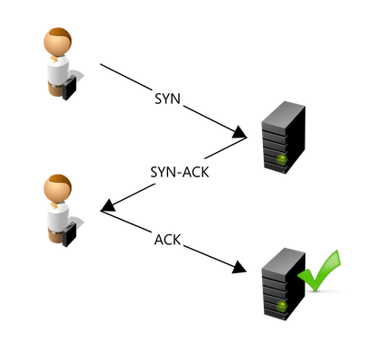

# TCP/IP

Ce fichier comporte des informations à propos des protocoles TCP/IP.

## Flags TCP

Les headers TCP contiennent des flags. Ils font 1 bit, ils sont soit à 1 soit à 0, il y en a 6 ce qui fait que cela occupe 6 bits dans une tramme. Plusieurs flags peuvent être à 1 lors d'une transmission.

* **SYN** (synchronize) = demande de synchronisation ou établissement de connexion
* **ACK** (acknowledgement) = signale que le paquet est un accusé de réception
* **PSH** (push) = données à envoyer tout de suite
* **URG** (urgent) = signale la présence de données urgentes
* **FIN** (finish) = demande la fin d'une connexion
* **RST** (reset) = rupture anormale de la connexion

Les scans se font la plupart du temps avec SYN, ACK et RST.

Image d'une connexion **Three-way handshake** :  
  

Image d'une **Connection termination** :  
  

## Forgeage de paquets

Les outils de forgeage de paquets (packet crafting) permettent à un attaquant de créer des paquets customisés. [Packet Builder](https://www.colasoft.com/packet_builder), [packETH](http://packeth.sourceforge.net/packeth/Home.html), [Bit-Twist](http://bittwist.sourceforge.net), [Omnipacket](https://omnipacket.com) permettent de forger des paquets.