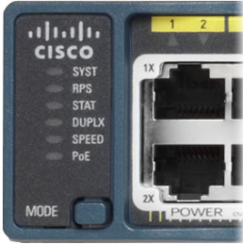

# Signification des LED des commutateurs

Des LED sont placés devant les commutateurs pour informer sur l'état de fonctionnement de celui-ci.

|     Nom     | Numéro | Signification                                | 
|-------------|--------|----------------------------------------------|
| SYST        | 1      | Système                                      |
| RPS         | 2      | Si commutateur prend en charge RPS           |
| STAT        | 3      | Indique que les états des ports sont activés |
| DUPLEX      | 4      | Bidirectionnalité du port                    |
| SPEED       | 5      | Vitesse de port                              |
| PoE         | 6      | Si commutateur prend en charge PoE           |
| Bouton MODE | 7      |                                              |
| LED du port | 8      | Etat du port                                 |

* **LED système** : indique si le système est bien alimenté et s'il fonctionne correctement. Si la LED est éteinte, cela signifie que le système est hors tension. Si la LED est verte, le système fonctionne normalement. Si la LED est orange, le système est sous tension mais ne fonctionne pas correctement.

* **LED système d'alimentation redondante (RPS)** : affiche l'état du système RPS. Si la LED est éteinte, le système RPS est éteint ou n'est pas correctement connecté. Si la LED est verte, le système RPS est connecté et prêt à fournir l'alimentation de secours. Si la LED est verte et clignote, le système RPS est connecté mais n'est pas disponible parce qu'il alimente un autre périphérique. Si la LED est orange, le système RPS est en veille ou en erreur. Si la LED est orange et clignote, l'alimentation interne du commutateur a rencontré une erreur et le système RPS a pris le relais de l'alimentation.

* **LED état port** : indique que le mode état de port est sélectionné lorsque la LED est verte et clignote. Il s'agit du mode par défaut. Lorsque cette option est sélectionnée, les LED du port affichent des couleurs de différentes significations. Si la LED est éteinte, aucune liaison n'est établie ou le port a été arrêté administrativement. Si la LED est verte, une liaison est établie. Si la LED est verte et clignote, la liaison est active et le port envoie ou reçoit des données. Si la LED est verte, puis orange, une panne au niveau de la liaison est présente. Si la LED est orange, le port est bloqué pour s'assurer que le domaine de redirection ne présente pas de bouclage et ne redirige pas de données (en général, les ports restent à cet état au cours des 30 premières secondes suivant leur activation). Si la LED est orange et clignote, le port est bloqué pour éviter tout bouclage dans le domaine de redirection.

* **LED de bidirectionnalité du port** : indique que le mode de bidirectionnalité du port est sélectionné lorsque la LED est verte. Lorsque ce mode est sélectionné, les LED éteintes indiquent les ports en mode bidirectionnel non simultané. Si la LED du port est verte, le port est en mode bidirectionnel simultané.

* **LED de vitesse de port** : indique que le mode vitesse de port est sélectionné. Lorsque cette option est sélectionnée, les LED du port affichent des couleurs de différentes significations. Si la LED est éteinte, le port fonctionne à 10 Mbit/s. Si la LED est verte, le port fonctionne à 100 Mbit/s. Si la LED est verte et clignote, le port fonctionne à 1000 Mbit/s.

* **LED de mode PoE (Power over Ethernet)** : si le mode POE est pris en charge, une LED de mode PoE est présente. Si la LED est éteinte, le mode PoE n'est pas sélectionné et aucun port n'est privé de courant ou ne présente d'erreur. Si la LED est orange et clignote, le mode PoE n'est pas sélectionné mais au moins un port est privé de courant ou présente une erreur relative au PoE. Si la LED est verte, le mode PoE est sélectionné et les LED de port présentent différentes couleurs, dont la signification varie. Si la LED de port est éteinte, le mode PoE est désactivé. Si la LED de port est verte, le mode PoE est activé. Si la LED de port alterne entre le vert et l'orange, le mode PoE est refusé car l'alimentation du périphérique entraînerait un dépassement de la capacité électrique du commutateur. Si la LED est orange et clignote, le mode PoE est désactivé en raison d'une erreur. Si la LED est orange, le mode PoE a été désactivé pour le port.