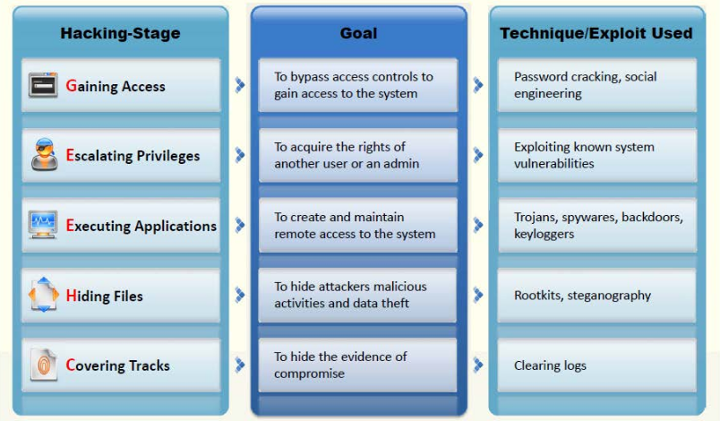

# Méthodologie de hacking

La **CEH Hacking Methodology (CHM)** consiste à suivre un ordre particulier lors du hack qui sont les suivantes :

* **1 - Gaining access - Obtention d'accès**
Cela consiste à obtenir un accès non administrateur à une machine, en utilisant n'importe quelle technique de hack, puis réaliser une escalade de privilère et devenir root.

* **2 - Maintaining access - Maintien d'accès**
Maintenir un accès à la machine pour effectuer des actions malicieuses, exécuter des applications, voler, cacher des fichiers.

* **3 - Clearing logs**
Action d'effacer des activités sur la machine.

Schéma qui explique le CHM :  
  