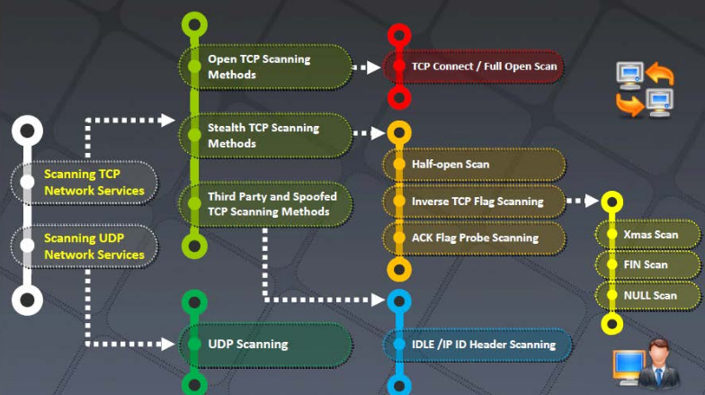
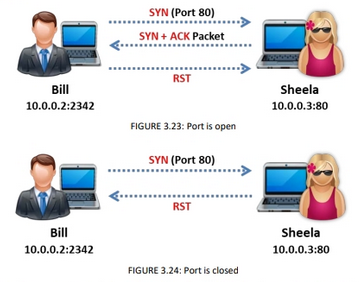
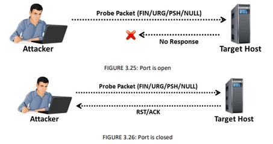
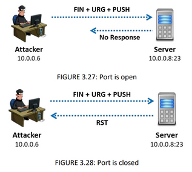

# Les types de scan

Procédure de scan :  
  

**Scan ICMP echo**  
Ce scan ping simplement les machines sur un réseau, si elles répondent les hôtes sont alive.

**Scan TCP connect / Full Open Scan**  
Utilise le 3 way handshake pour identifier les réponses renvoyées par la cible.  
  

**Stealth Scan (Half-Open Scan)** ou **SYN Scan**   
Envoyer un paquet RST après la première réponse 3WH SYN + ACK de la cible. Cela permet de bypasser des règles de firewall et méchanismes d'authentification.   
  

**Inverse TCP flag scanning**  
Envoyer un paquet avec un flag TCP (FIN, RG, PSH) ou sans flag. Si la cible ne répond pas par un RST le port est ouvert.  
  

**Xmas Scan**  
Le scan Xmas envoie des flags FIN, URG et PSH. Ne fonctionne quasiment que sur des Linux.  
  

**ACK flag Probe**  
Envoie un ACK et analyse le header (TTL et WINDOW) du paquet RST reçu pour déterminer si port est ouvert. Si la valeur TTL du RST est moins que 64, le port est ouvert. Si la veleur WINDOW ou RST ne sont pas égales à 0, le port est ouvert.  
On peut aussi envoyer un ACK probe avec un numéro de séquence random, si il n'y a pas de réponse, cela peut vouloir dire que le port est filtré, si il y a une réponse RST, alors le port n'est pas filtré.   
  

**UDP**  
le système ne répond pas si le port est ouvert.  
On reçoit un **ICMP Port unreachable** si le port est fermé.  

## Banner grabbing

Le banner grabbing peut être utilisé pour récupérer des noms de service, numéro de versions, systèmes d'exploitation.  

Il faut s'en prémunir en utilisant les mode **mod_headers** sous apache par exemple.